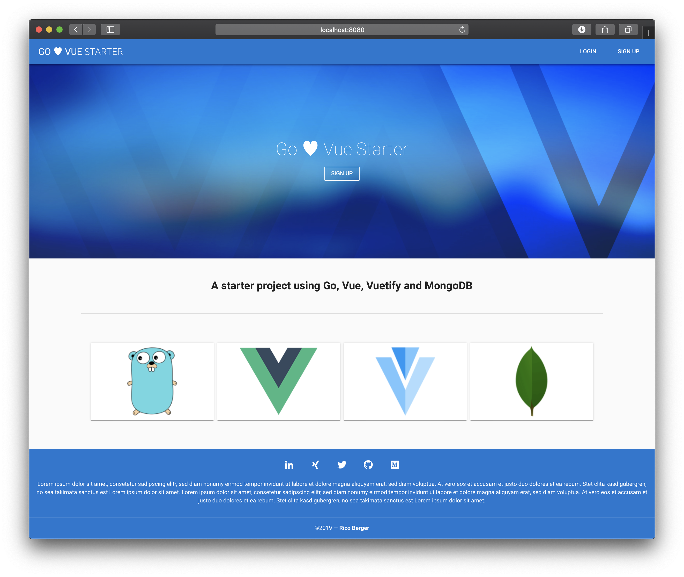
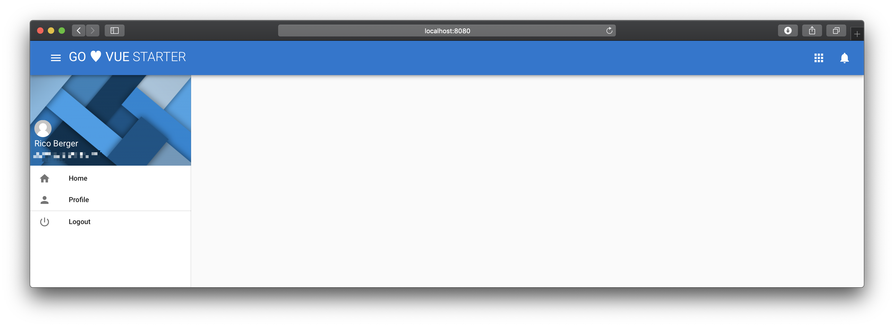

# Go &#9829; Vue Starter

This project contains a quick starter kit for a Go project using Vue as single page app. The Go server uses MongoDB to store data, supports JWT authentication and embedding the Vue build. The Vue single page app supports routing via Vue Router, state management via Vuex and implements Googles Material Design using Vuetify.



## Features

- [x] Go API using [Gorilla mux](github.com/gorilla/mux)
- [x] Go server to serve the Vue app
- [x] [MongoDB](github.com/mongodb/mongo-go-driver) integration
- [x] [JWT](github.com/dgrijalva/jwt-go) authentication
- [x] Embedding Vue build into Go binary using [esc](https://github.com/mjibson/esc)
- [x] Go server configuration via [.yml](gopkg.in/yaml.v2) file
- [x] Using Go Modules for dependency management
- [x] Makefile based project
- [x] Routing via [vue-router](https://github.com/vuejs/vue-router)
- [x] State management via [vuex](https://github.com/vuejs/vuex)
- [x] Material Design using [vuetify](https://github.com/vuetifyjs/vuetify)
- [x] TypeScript support
- [x] Class-Style Vue Components



## Building and running

The **Go &#9829; Vue Starter** contains a Go server which serves the single page Vue app and an API whiche handles all request from the Vue frontend. To run the Go server and Vue app as separated process run the following commands:

```sh
git clone github.com/ricoberger/go-vue-starter
go get -u github.com/mjibson/esc

# Run the Vue app on localhost:8080
cd go-vue-starter/web/vue.js

yarn install
yarn serve

# Run the Go server on localhost:8081
cd go-vue-starter

make build
./bin/starter
```

If you want to serve the Vue frontend app within the Go server run:

```sh
git clone github.com/ricoberger/go-vue-starter
go get -u github.com/mjibson/esc

# Build the Vue app
cd go-vue-starter/web/vue.js

yarn install
yarn build

# Run the Go server and the Vue app on localhost:8080
cd go-vue-starter

make build
./bin/starter
```

## Usage and configuration

You can build and run the **Go &#9829; Vue Starter** by your own or you can use the [prebuild binaries](https://github.com/ricoberger/go-vue-starter/releases). Befor you start the **Go &#9829; Vue Starter** edit the `config.yml` file:

```yaml
# Port where the go-vue-starter should listen on
listen_address: :8080

api:
  # Domain is for the frontend
  domain: http://localhost:8080
  # Signing secret for the jwt authentication
  signing_secret: "your-super-secret"

app:

database:
  # Connection URL for MongoDB and the name of the MongoDB database
  mongodb:
    connection_uri: mongodb://localhost:27017
    database_name: go-vue-starter

# Email credentials to send the verification, reset password, etc. email
mail:
  identity:
  username:
  password:
  host:
  addr:
  from:

  # Use html or plaintext emails, must be true or false
  html:

  # Email subjects
  subjects:
    welcome: "Welcome to the Go + Vue Starter"
    reset-password: "Reset password request"
    email-verification: "Verify your email address"
    email-changed: "Your email address has been changed"
```

After you adjust the configuration file you can use the **Go &#9829; Vue Starter** as follows:

```
Usage of starter:
  -config.file string
      Path to the configuration file. (default "config.yml")
  -debug
      Show debug information.
  -version
      Show version information.
```

## Dependencies

**Go &#9829; Vue Starter** is build up on some dependencies for Go and Vue. The Go dependencies are:

- [crypto - Go supplementary cryptography libraries](golang.org/x/crypto)
- [esc - A simple file embedder for Go](https://github.com/mjibson/esc)
- [gorilla/mux - A powerful URL router and dispatcher for golang](github.com/gorilla/mux)
- [jwt-go - Golang implementation of JSON Web Tokens (JWT)](github.com/dgrijalva/jwt-go)
- [logrus - Structured, pluggable logging for Go](github.com/sirupsen/logrus)
- [mongo-go-driver - The Go driver for MongoDB](github.com/mongodb/mongo-go-driver)
- [yaml.v2 - YAML support for the Go language](gopkg.in/yaml.v2)

The dependencies for the Vue app are:

- [jwt-decode - Decode JWT tokens](https://github.com/auth0/jwt-decode)
- [md5 - a JavaScript function for hashing messages with MD5](https://github.com/pvorb/node-md5)
- [vue - Vue.js is a progressive, incrementally-adoptable JavaScript framework for building UI on the web](https://github.com/vuejs/vue)
- [vue-class-component - ES / TypeScript decorator for class-style Vue components](https://github.com/vuejs/vue-class-component)
- [vue-property-decorator - Vue.js and Property Decorator](https://github.com/kaorun343/vue-property-decorator)
- [vue-router - The official router for Vue.js](https://github.com/vuejs/vue-router)
- [vuetify - Material Component Framework for Vue.js 2](https://github.com/vuetifyjs/vuetify)
- [vuex - Centralized State Management for Vue.js](https://github.com/vuejs/vuex)
- [vuex-class - Binding helpers for Vuex and vue-class-component](https://github.com/ktsn/vuex-class)
